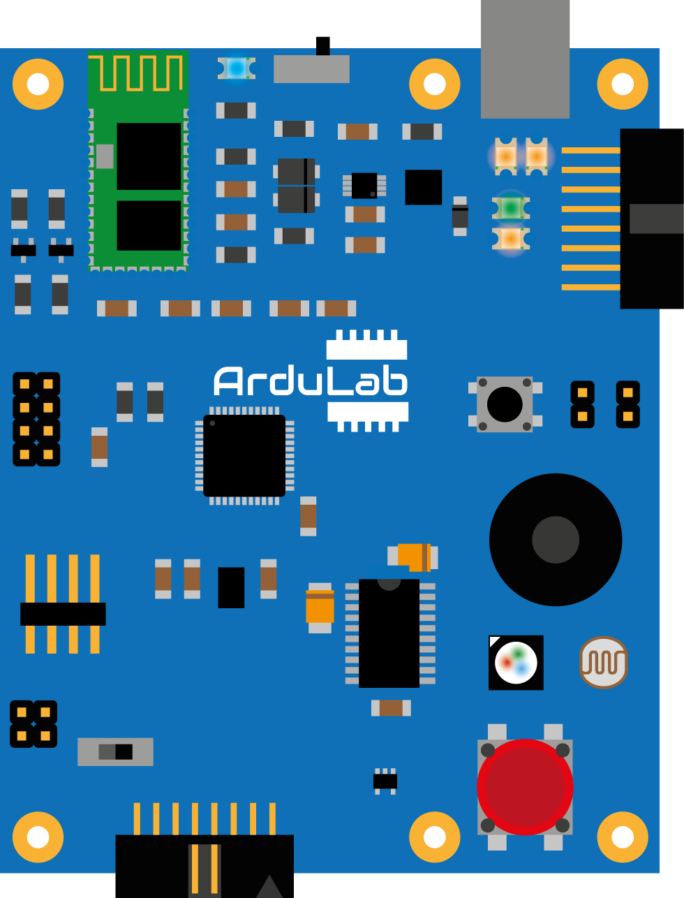
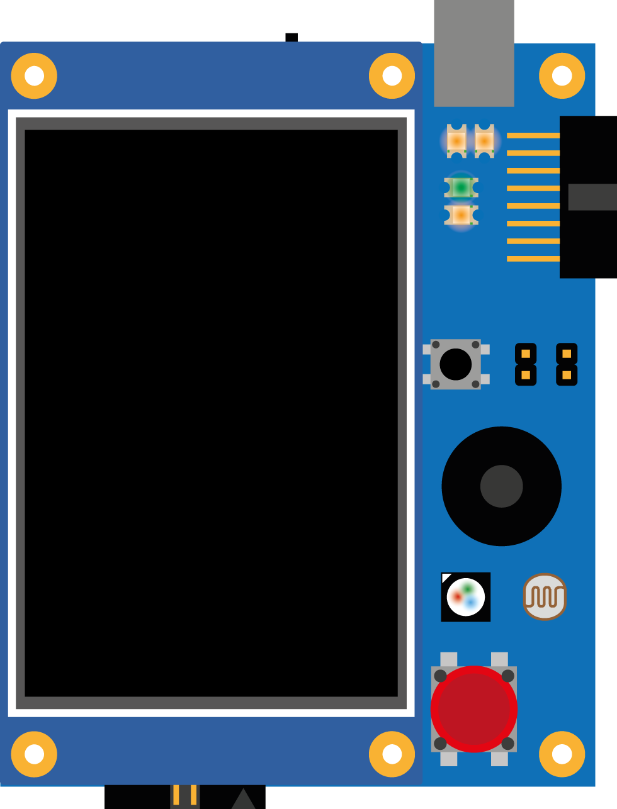
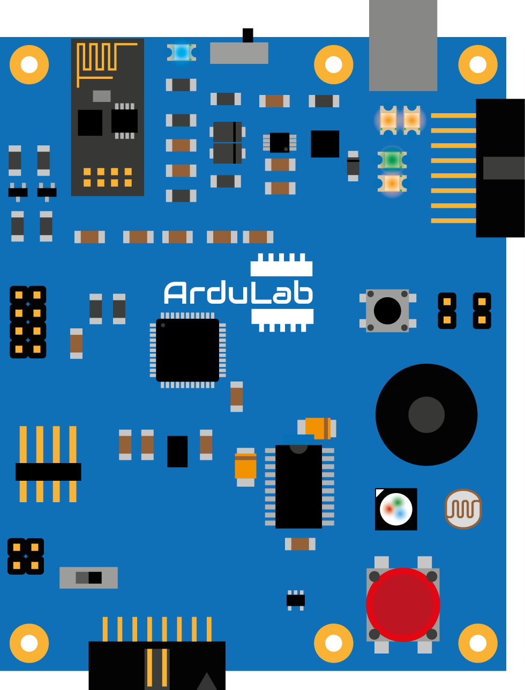

[![GitHub Release][releases-shield]][releases]
[![License][license-shield]](LICENSE)

[![Project Maintenance][maintenance-shield]][maintenance]
[![BuyMeCoffee][buymecoffee-shield]][buymecoffee]

# ArduLab

The ArduLab board is a robotic platform designed for the ICAI Technological Campus. It has been created with educational purposes for developing robotic proyects based on de [Arduino](https://www.arduino.cc) environment.

   
   
   

## Features
* Atmega32U4 microcontroller (same as Arduino Leonardo)
* RGB Led
* LDR
* Buzzer
* Pushbutton
* DC Motor driver (H-Bridge)
* LiPo charging system
* Bluetooth connectivity (HC-05)

It supports the [Itead Nextion Displays](https://www.itead.cc/display/nextion.html) via serial port and also can be plugged directly to the [ElectroLab](https://github.com/SpaceDIY/ElectroLab) board to expand it's functions!

## Project tree

<li><a href="./Hardware/">Hardware</a></li>
<li><a href="./Firmware/">Firmware</a></li>
<li><a href="./Documentation/">Documentation</a></li>

<li><a href="./README.md">README.md</a></li>

[releases-shield]: https://img.shields.io/github/release/JGAguado/ArduLab.svg?style=for-the-badge
[releases]: https://github.com/JGAguado/ArduLab/releases

[license-shield]: https://img.shields.io/badge/License-CC%20BY--NC--SA%204.0-lightgrey.svg?style=for-the-badge

[maintenance-shield]: https://img.shields.io/badge/maintainer-J.%20G.%20Aguado-blue.svg?style=for-the-badge
[maintenance]: https://github.com/JGAguado

[buymecoffee-shield]: https://img.shields.io/badge/buy%20me%20a%20coffee-support-yellow.svg?style=for-the-badge
[buymecoffee]: https://www.buymeacoffee.com/J.G.Aguado

